# **ADNI QPP Template Analysis**
This repository contains MATLAB scripts for analyzing **Quasi-Periodic Patterns (QPPs)** from the **ADNI dataset**. The analysis focuses on **waveform visualization, correlation analysis, and projection onto fMRI time series**.

## **Overview**
This repository includes three primary MATLAB scripts:
- **QPP Waveform Visualization:** Plots QPP waveforms across Neuromark networks.
- **QPP Correlation Analysis:** Computes correlation matrices across different QPP templates and evaluates significance.
- **QPP Projection:** Projects QPP templates onto fMRI time series and evaluates occurrences over time.

Below are example outputs from each section:

---

## **1️⃣ QPP Waveform Visualization**
📜 **Script:** `m1_QPP_waveform_visualization_neuromark.m`  
📊 **Purpose:** Visualize QPP waveforms across different brain networks and subdomains.

### **Example Outputs**
- **QPP Waveforms Across Networks**  
  *Visualization of waveform patterns across multiple Neuromark networks.*  
  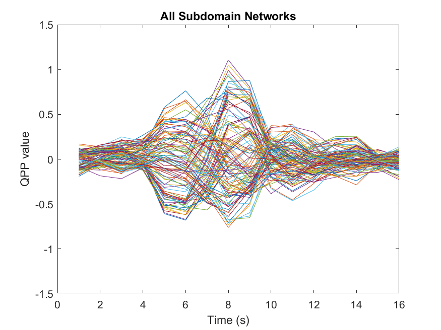

- **Network-Specific Coloring of QPPs**  
  *Each network is color-coded to show activity over time.*  
  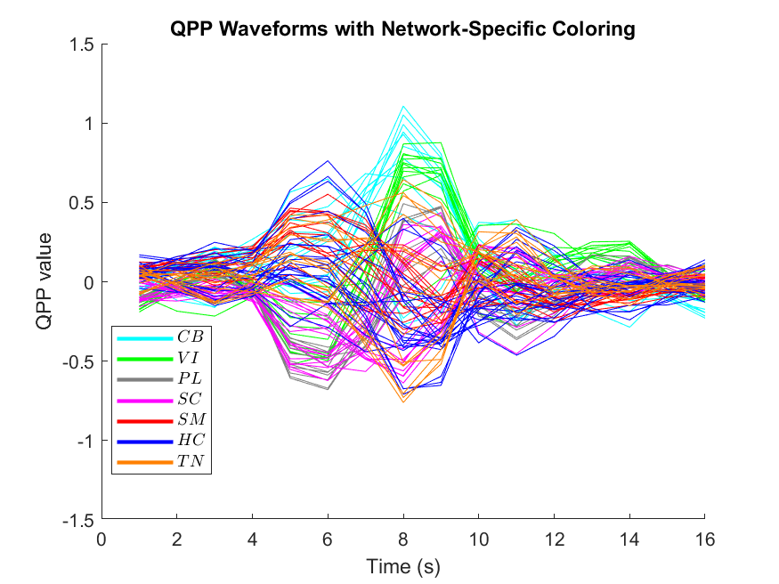

- **HC vs TN Correlation**  
  *Comparison of Quasi-Periodic Patterns between the HC and TN networks.*  
  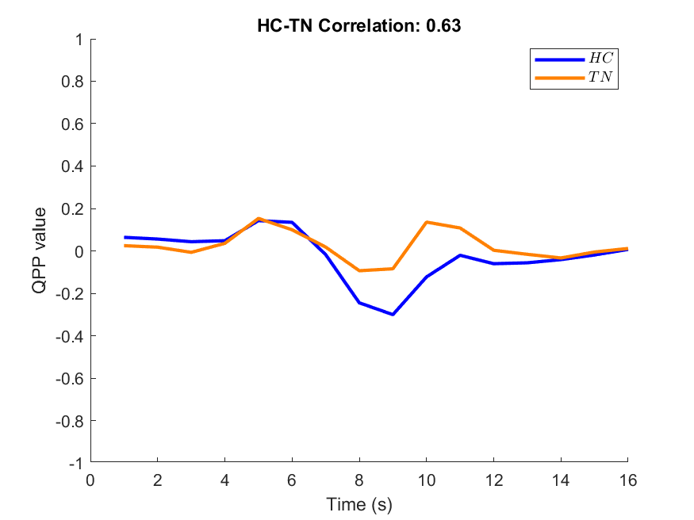

- **Network Correlation Matrix**  
  *Shows correlations between different Neuromark networks based on QPP signals.*  
  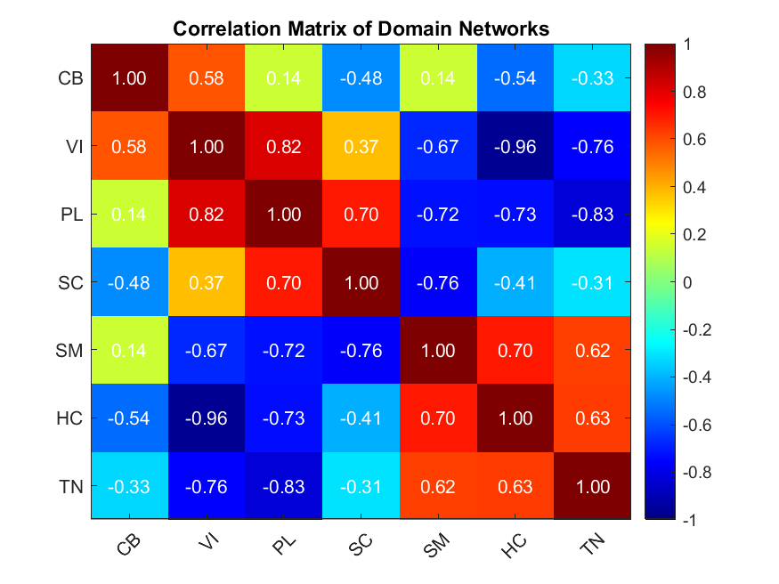

- **Subdomain Correlation Matrix**  
  *A correlation matrix focused on subdomains of the Neuromark networks.*  
  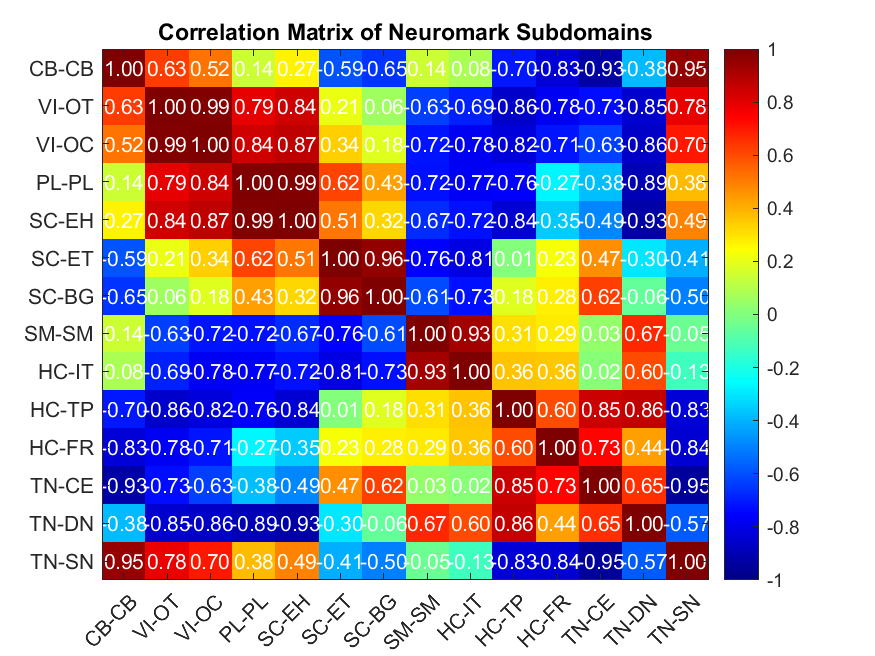

---

## **2️⃣ QPP Correlation Analysis**
📜 **Script:** `m2_QPP_corr_analysis.m`  
📊 **Purpose:** Compute **correlation matrices** between different QPP templates and evaluate network significance.

### **Example Outputs**
- **QPP Template Correlation Matrix**  
  *Compares correlation across all QPP templates.*  
  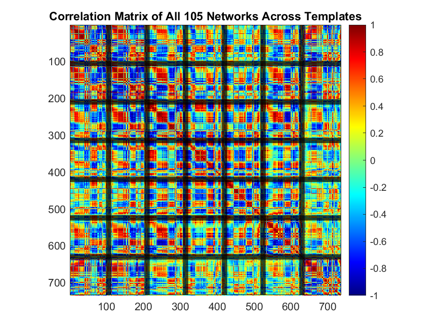

- **QPP Template Correlation Analysis**  
  *Computation of self-correlation differences between QPP templates.*  
  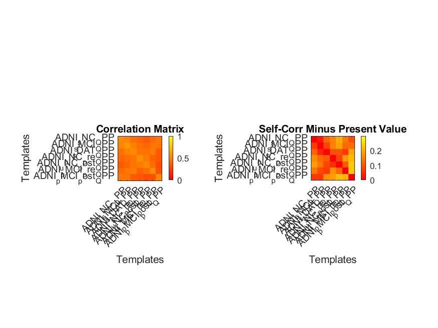

- **QPP Correlation Comparison**  
  *Comparing correlation matrices between different QPP templates.*  
  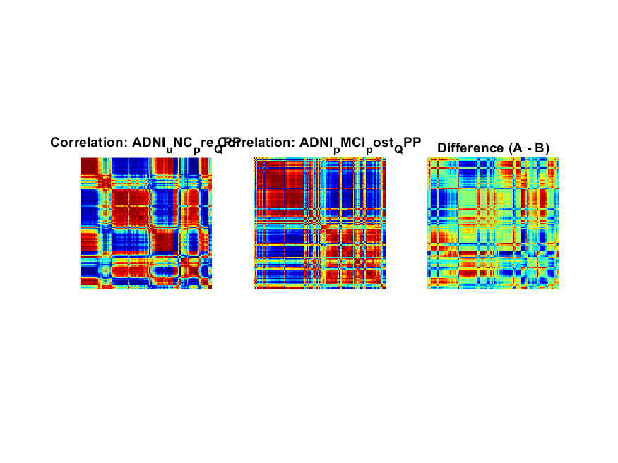

- **QPP Difference Correlation Matrix**  
  *Visualizes the difference between QPP correlation matrices.*  
  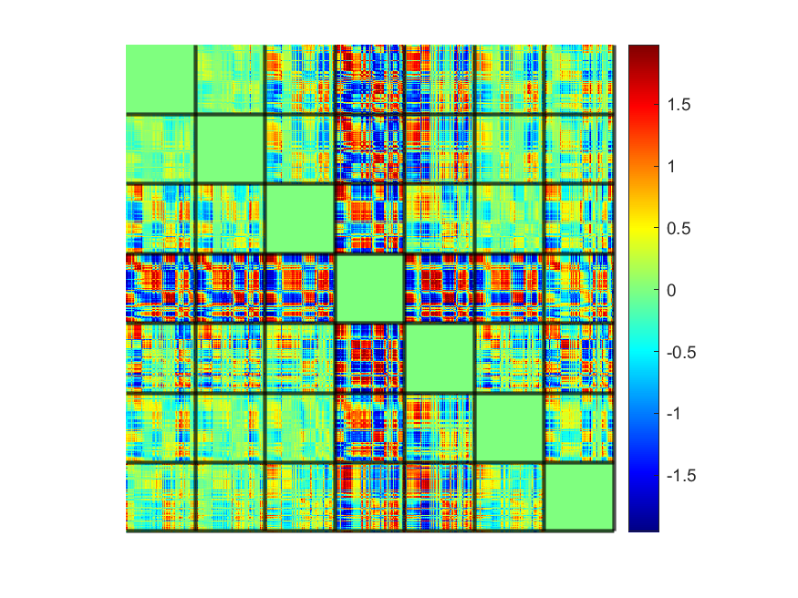

- **QPP Full Correlation Matrix Comparison**  
  *Comparison of full correlation matrices across templates.*  
  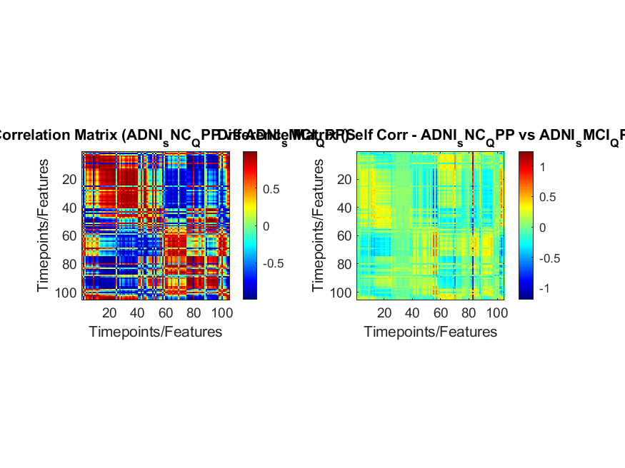

- **ICN Significance in QPP Correlation**  
  *Significance testing of Independent Component Networks (ICNs).*  
  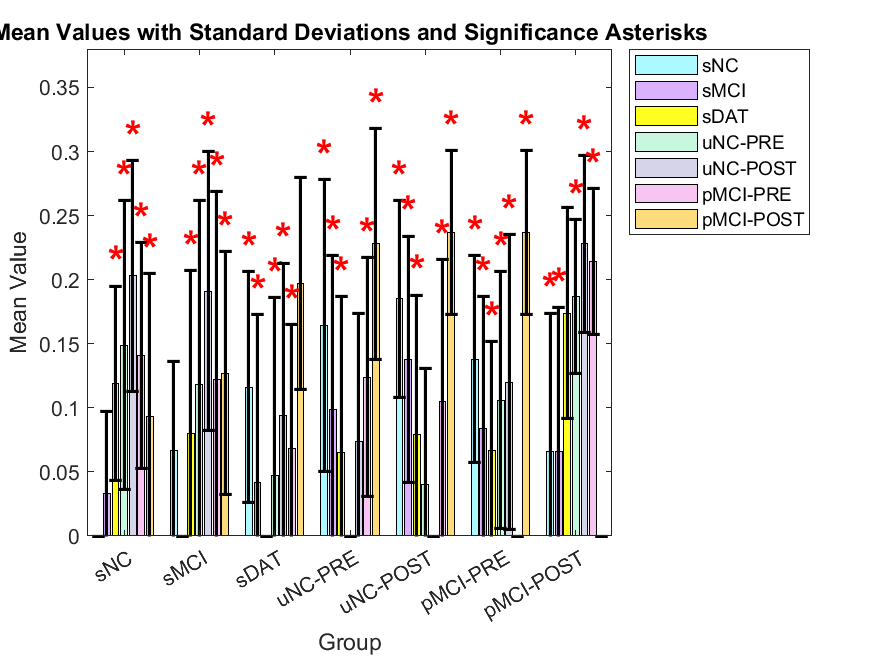

- **Network Variance Comparison**  
  *Comparison of network variance across templates.*  
  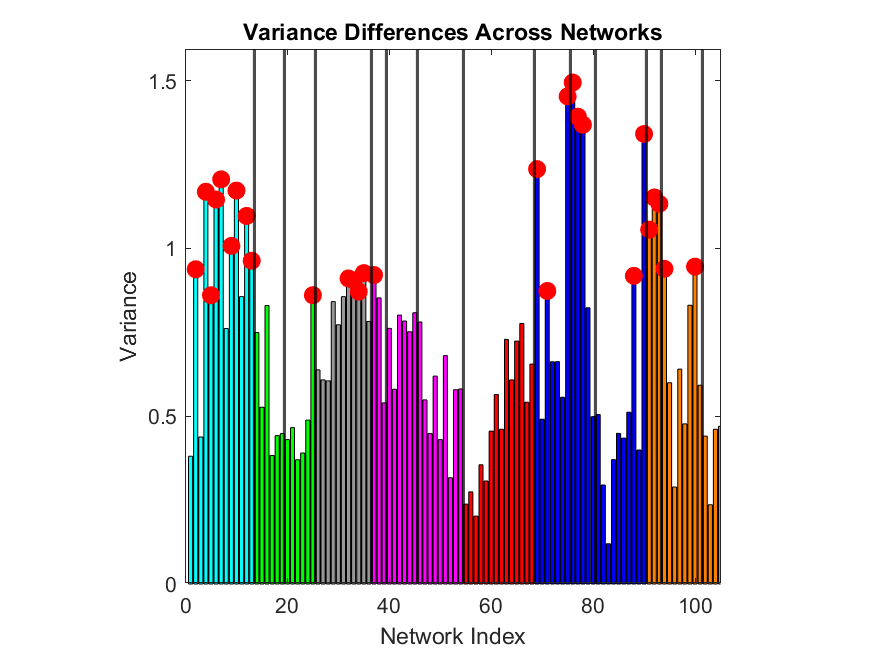

- **Boxplot of Mean Correlation Values**  
  *Boxplot visualization for comparison of QPP template correlation means.*  
  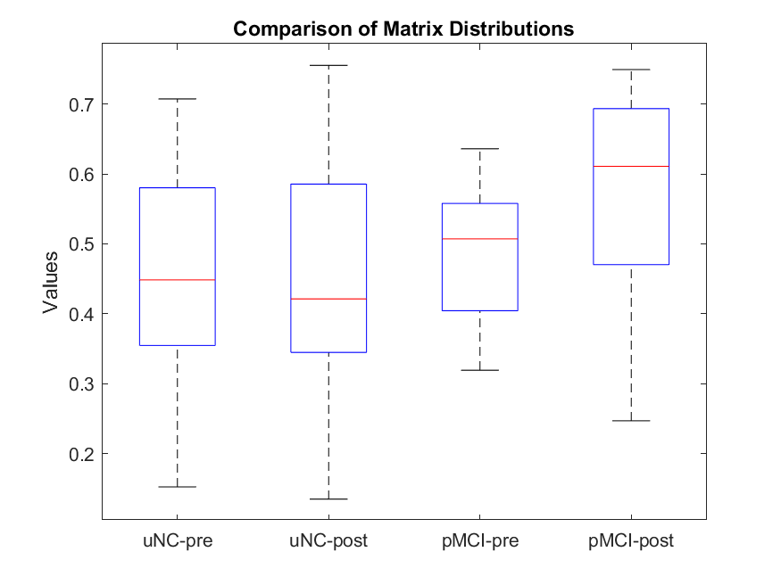

---

## **3️⃣ QPP Projection**
📜 **Script:** `m3_QPP_projection.m`  
📊 **Purpose:** Project QPP templates onto **fMRI time series** and analyze **dwell times**.

### **Example Outputs**
- **Correlation Plot Over Time**  
  *Sliding window correlation of QPP projection onto fMRI data.*  
  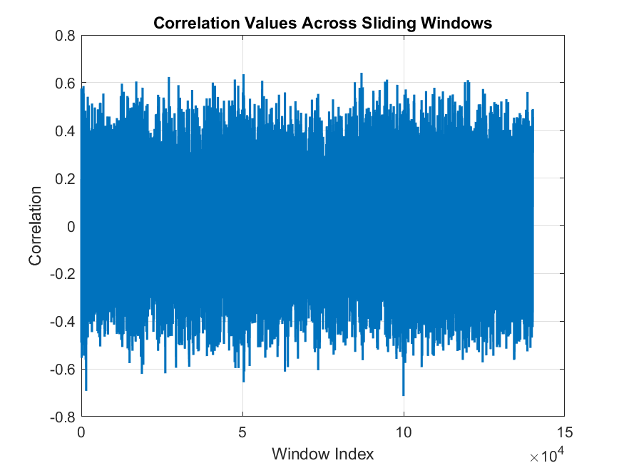

- **Correlation Histogram**  
  *Histogram of correlation values across sliding windows.*  
  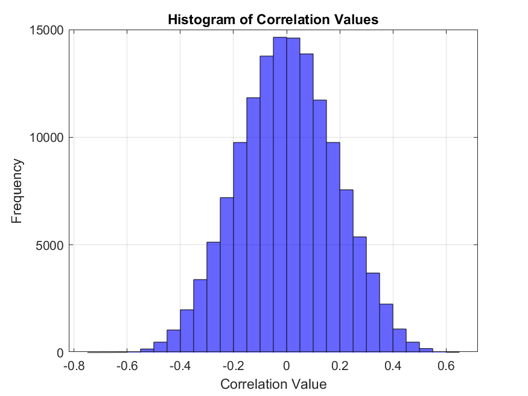

- **Correlation with Dwell Time Markers**  
  *Adding dwell time markers to the correlation plot.*  
  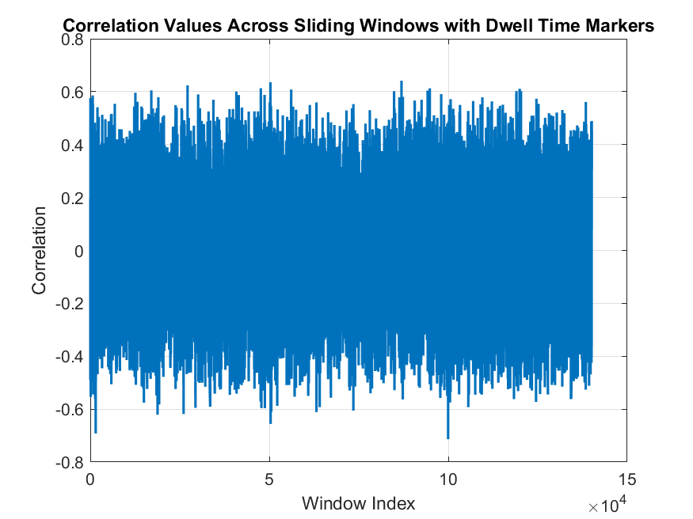

- **Dwell Time Histogram**  
  *Histogram of time intervals between significant correlation events.*  
  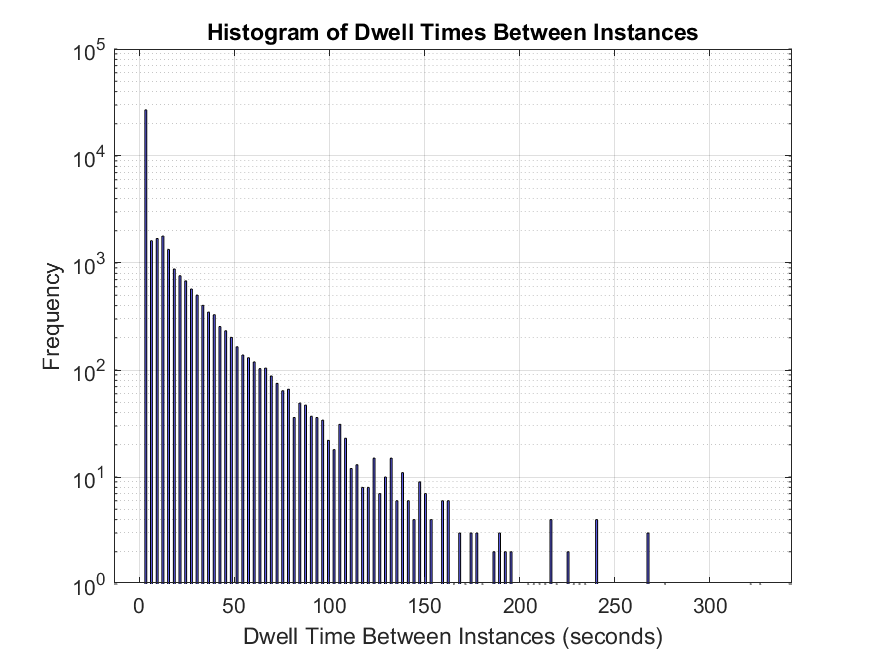

---

## **4️⃣ Python Data Visualization**
📜 **Script:** `python_data_visualization.ipynb`  
📊 **Purpose:** This **standalone Jupyter Notebook** provides additional visualization for the **longitudinal dataset**.  
It focuses on:
- **Graphing projection values** over time.
- **Visualizing changes** in QPP occurrences across different conditions.
- **Comparing QPP activity** across different ADNI cohorts.

### **Example Outputs**
- **Longitudinal Transition Point Graph**  
  *Visual representation of longitudinal changes in QPP projection values.*  
  

- **QPP Projection Results**  
  *QPP projection analysis across different timepoints and conditions.*  
  
